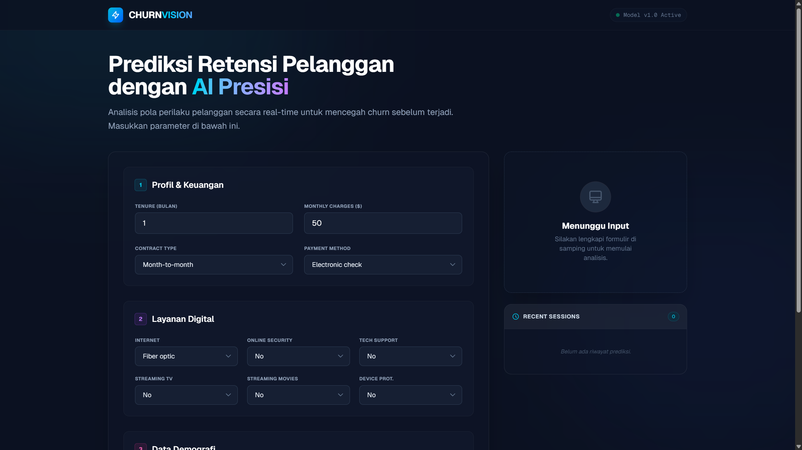
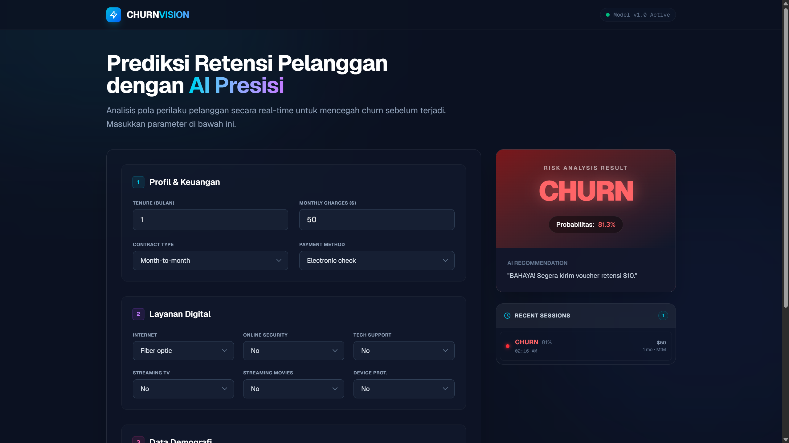

# 🔮 ChurnVision: Customer Retention Intelligence System


> **Live Demo:** [Klik di sini untuk mencoba aplikasi]([https://link-vercel-kamu-disini.vercel.app](https://hanrsyidin-telco-customer-churn-das.vercel.app/))  
> **Backend API:** [Hugging Face Space](https://hanrsyidin-churn-api-farhan.hf.space/docs)

## 📋 Overview

**ChurnVision** adalah sistem analitik prediktif *end-to-end* yang dirancang untuk membantu bisnis telekomunikasi mengidentifikasi pelanggan yang berisiko berhenti berlangganan (*churn*) secara *real-time*.

Berbeda dengan model ML statis yang hanya hidup di Jupyter Notebook, proyek ini menjembatani kesenjangan antara **Data Science** dan **Software Engineering**. Sistem ini menerima input demografis dan finansial pelanggan, memprosesnya melalui API Machine Learning, dan memberikan:
1.  **Prediksi Status:** (Churn / Stay).
2.  **Skor Probabilitas:** Seberapa besar kemungkinan pelanggan akan pergi.
3.  **Rekomendasi Bisnis:** Strategi mitigasi yang disarankan secara otomatis.

---

## 🏗️ Architecture & Tech Stack

Sistem ini dibangun dengan arsitektur *decoupled* untuk skalabilitas, memisahkan logika inferensi AI dari antarmuka pengguna.

### 🧠 Backend (Machine Learning & API)
* **Python & Scikit-Learn:** Pelatihan model, *preprocessing pipeline*, dan serialisasi model.
* **FastAPI:** Framework modern untuk melayani model ML sebagai RESTful API yang cepat.
* **Hugging Face Spaces:** Platform deployment untuk server inferensi (Dockerized).

### 💻 Frontend (User Interface)
* **Next.js 14 (App Router):** React framework untuk performa dan SEO.
* **TypeScript:** Menjamin keamanan tipe data antara Frontend dan API response.
* **Tailwind CSS:** Styling modern dengan pendekatan *Glassmorphism*.
* **Fetch API:** Integrasi asinkronus ke backend Python.

---

## 📊 Model Performance & Methodology

Proyek ini menggunakan dataset **Telco Customer Churn** standar industri.

### Workflow Data Science:
1.  **Exploratory Data Analysis (EDA):** Analisis korelasi fitur terhadap target churn.
2.  **Preprocessing:** * Encoding variabel kategorikal (Gender, PaymentMethod, dll).
    * Scaling fitur numerik (Tenure, MonthlyCharges).
3.  **Model Selection:**
    * Model yang digunakan: **[SEBUTKAN MODELMU, MISAL: Random Forest Classifier / XGBoost]**.
    * Alasan pemilihan: Memberikan keseimbangan terbaik antara presisi dan *recall*.

### Metrik Evaluasi:
* **Accuracy:** [MASUKKAN ANGKA, MISAL: 82%]
* **F1-Score:** [MASUKKAN ANGKA]
* **Recall (Churn Class):** [MASUKKAN ANGKA - PENTING UNTUK KASUS CHURN]

> *Catatan: Dalam kasus Churn, kami memprioritaskan Recall untuk meminimalkan False Negatives (gagal mendeteksi pelanggan yang akan pergi).*

---

## 📸 Screenshots

### 1. Dashboard Utama (Glassmorphism UI)

*(Tampilan antarmuka pengguna yang modern dan responsif)*

### 2. Hasil Analisis Risiko

*(Visualisasi hasil prediksi beserta probabilitas dan rekomendasi)*

---

## 🚀 Installation & Local Setup

Jika Anda ingin menjalankan proyek ini secara lokal:

### Prerequisites
* Node.js (v18+)
* Python (v3.9+)

### 1. Clone Repository
```bash
git clone [https://github.com/hanrsyidin/nama-repo-kamu.git](https://github.com/hanrsyidin/nama-repo-kamu.git)
cd nama-repo-kamu
```

### 2. Setup Frontend
```bash
# Install dependencies
npm install

# Buat file .env.local
echo "NEXT_PUBLIC_API_URL=[https://hanrsyidin-churn-api-farhan.hf.space/predict](https://hanrsyidin-churn-api-farhan.hf.space/predict)" > .env.local

# Jalankan server development
npm run dev

Buka http://localhost:3000 di browser Anda.
```

### 👤 Author
Ahmad Farhan Rasyidin

Informatics Engineering Student @ Sriwijaya University

* Focus: AI, Data Science, & Fullstack Development

* Portfolio: hanrsyidin.info
